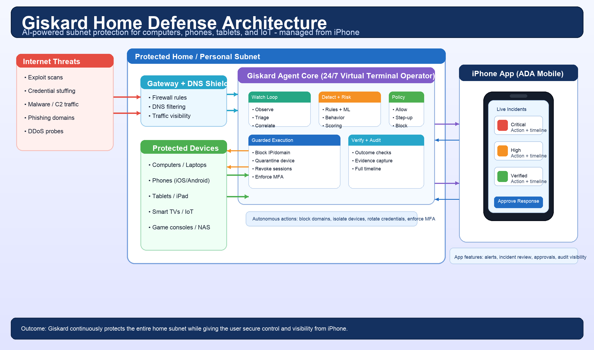
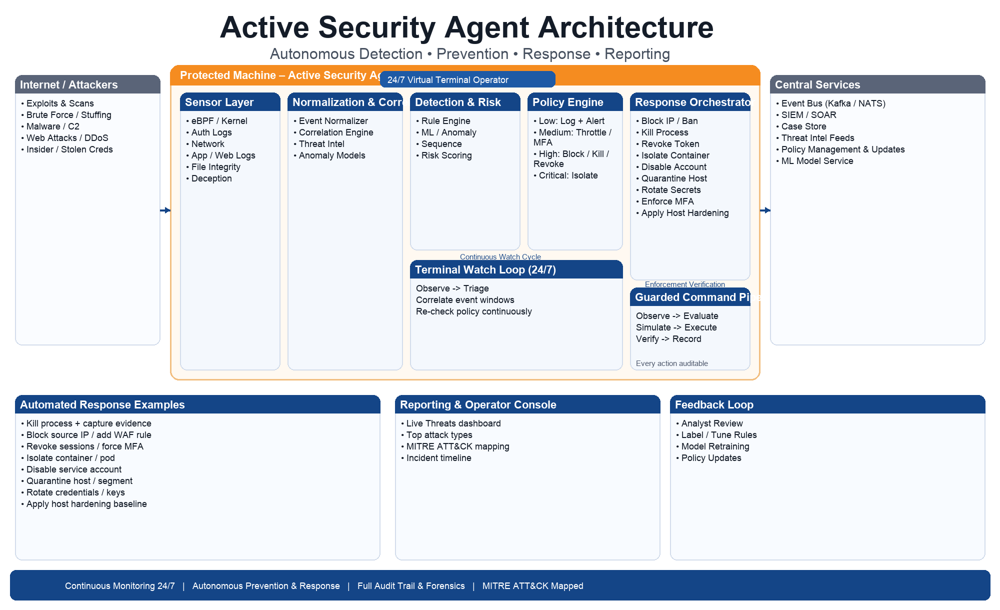
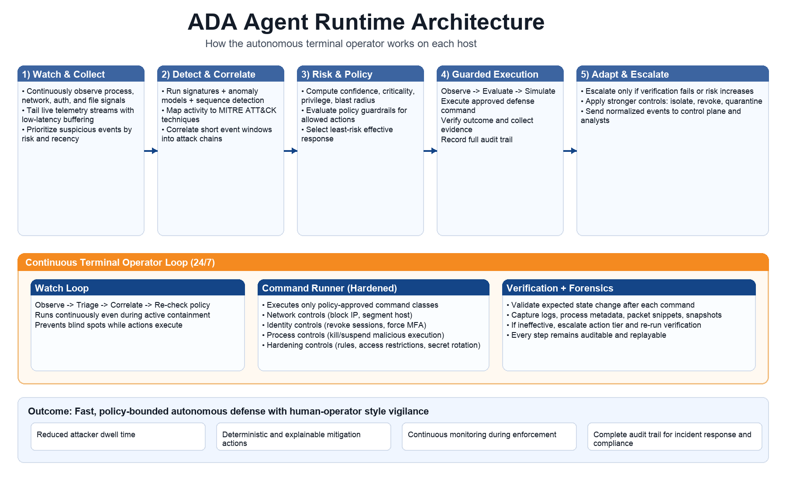
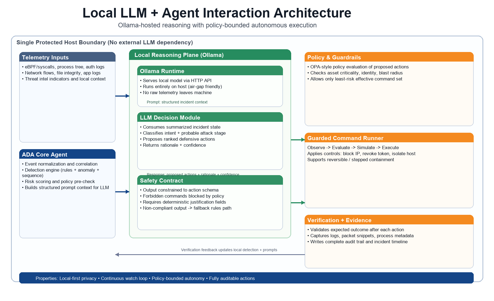

# Active Defense Agent (ADA)  
## Autonomous Security Architecture

---

## 1. Overview

The **Active Defense Agent (ADA)** is an autonomous, policy-driven security platform designed to:

- Continuously monitor systems connected to the internet  
- Detect intrusion attempts and anomalous behavior in real time  
- Automatically contain and mitigate threats  
- Preserve forensic evidence  
- Provide actionable reporting and insights  

ADA operates at both the **host level (local agent)** and the **central control plane**, enabling fast local response with global intelligence.

ADA is designed to behave like a **24/7 virtual terminal security operator**: continuously watching live system activity, investigating suspicious patterns as they emerge, and applying defensive changes immediately when policy conditions are met.

---

## 2. Goals

### Primary Objectives
- Real-time threat detection and response
- Autonomous containment of attacks
- Continuous terminal-style monitoring and intervention
- Subnet-wide protection for home and small-office networks
- Protection for phones and tablets on protected subnets
- Deliver a secure iOS app for mobile visibility, alerts, and guided response
- Full audit trail and forensic readiness
- Identity-aware security enforcement
- Scalable across hosts, containers, and cloud environments

### Design Principles
- **Autonomous First** - Works even when disconnected
- **Policy Driven** - Deterministic guardrails for all actions
- **Least Risk Response** - Escalate only when necessary
- **Explainable Actions** - Every action is auditable
- **Zero Trust Enforcement** - Continuous verification
- **Tamper Resistant** - Protect the agent itself
- **Operator-Grade Vigilance** - Always-on monitoring loop with immediate action

---

## 3. High-Level Architecture

The system is composed of three major domains:

### 3.1 External Threat Surface
- Internet attackers (exploits, brute force, malware, DDoS)
- Insider threats and stolen credentials
- Third-party integrations and cloud services

### 3.2 Protected Host (Active Defense Agent)
- Sensor Layer
- Local Processing (Detection + Risk + Policy)
- Local Enforcement
- Evidence Collection

### 3.3 Protected Subnet (Home / Small Office LAN)
- Gateway and DNS visibility (router, firewall, resolver logs)
- East-west traffic monitoring for lateral movement
- Device profiling for IoT, endpoints, phones/tablets, and unmanaged hosts
- Segment-aware response across trusted and untrusted zones

### 3.4 Central Platform (Control Plane)
- Event ingestion and streaming
- Correlation and analytics
- Global policy engine
- Response orchestration
- Reporting and case management

---

## 4. Component Architecture

### 4.1 Sensor Layer (Host-Based)

Collects telemetry from multiple sources:

| Sensor Type | Description |
|------------|------------|
| Kernel / eBPF | Syscalls, runtime behavior |
| Network Monitoring | Connections, flows |
| File Integrity | Sensitive file changes |
| Auth & Identity | Logins, tokens, privileges |
| Application Logs | APIs, services, configs |
| Deception | Honeytokens, decoys |

---

### 4.1.1 Subnet Sensor Layer (Gateway + LAN)

Collects home/small-office network telemetry:

| Sensor Type | Description |
|------------|------------|
| Router / Firewall Logs | Inbound blocks, NAT flows, denied connections |
| DNS Monitoring | Domain lookups, sinkhole actions, suspicious destinations |
| DHCP / ARP Visibility | Device inventory, MAC/IP mapping, rogue devices |
| NetFlow / Packet Metadata | East-west and north-south traffic patterns |
| Wi-Fi Access Events | New client joins, auth failures, unusual roaming |
| Mobile Device Signals | OS type, posture state, risky app/network behavior (when available) |

---

### 4.2 Local Processing

#### Event Normalization
- Converts raw logs into structured events
- Adds metadata (host, user, process, context)

#### Detection Engine
- Signature-based rules (Sigma-like)
- Behavioral anomaly detection
- Sequence-based attack detection
- MITRE ATT&CK mapping

#### Terminal Watch Loop
- Maintains a continuous watch cycle over process, network, auth, and file events
- Prioritizes suspicious activity queues by risk and recency
- Correlates short event windows (seconds to minutes) like a live analyst session
- Triggers policy checks continuously, not only on batch intervals

#### Risk Scoring Engine
Evaluates:
- Confidence of detection
- Asset criticality
- Privilege level
- Blast radius
- Correlation with other events

#### Policy Engine
Determines response:

| Risk Level | Action |
|----------|--------|
| Low | Log + Alert |
| Medium | Throttle / Step-up Auth |
| High | Block / Kill / Revoke |
| Critical | Isolate / Quarantine |

---

### 4.3 Local Enforcement

Executes immediate defensive actions:

- Block IP / traffic (iptables/nftables)
- Kill malicious processes
- Revoke sessions / tokens
- Isolate container or host
- Disable accounts
- Rotate secrets / credentials
- Enforce MFA / step-up authentication
- Apply host hardening updates (firewall rules, service restrictions, access controls)
- Apply subnet controls (block domain, isolate VLAN/SSID, quarantine device)
- Trigger mobile-focused controls (isolate phone/tablet network segment, restrict risky destinations, force re-auth via IdP)

Enforcement is implemented as a guarded command pipeline that mirrors terminal operations:
- **Observe** -> **Evaluate** -> **Simulate** -> **Execute** -> **Verify** -> **Record**

---

### 4.4 Evidence & Data Store

Stores forensic artifacts:

- Raw event logs
- Packet snippets
- Process metadata
- System snapshots
- Timeline reconstruction

Features:
- Tamper-resistant storage
- Secure buffering
- Audit-ready logs

---

### 4.5 Central Platform (Control Plane)

#### Ingest & Message Bus
- Kafka / NATS streaming pipeline
- Secure ingestion (mTLS)

#### Analytics & Correlation
- Multi-host correlation
- Threat intelligence enrichment
- ATT&CK mapping

#### Global Policy Engine
- Organization-wide policies
- Context-aware decisioning
- Risk-based enforcement

#### Response Orchestrator
- Executes coordinated actions
- Cross-system remediation
- Playbooks and automation

#### Data & Reporting
- Case management
- Dashboards
- Incident timelines
- Compliance reporting

---

### 4.6 Integrations

- SIEM / XDR platforms
- SOAR tools
- Identity providers (IAM / IdP)
- Ticketing systems
- Email / Slack alerts
- Threat intelligence feeds
- Secrets managers
- Home/SOHO routers and firewalls (API/SSH)
- DNS filtering resolvers and network controllers
- Mobile device management / endpoint posture platforms (MDM/UEM)
- Apple Push Notification service (APNs) for real-time incident alerts

---

### 4.7 Autonomous Terminal Operator Mode

ADA's runtime behavior models an experienced SOC engineer at a shell:

- Continuously tails and inspects critical telemetry streams
- Opens short-lived investigations for suspicious chains of events
- Executes pre-approved defensive commands through policy guardrails
- Verifies command outcomes and rolls forward to stronger controls if needed
- Produces an auditable command/action timeline for every mitigation step

---

### 4.8 iOS App Architecture (ADA Mobile)

The iOS app extends ADA into a secure mobile control and response surface.

#### App Modules
- **Auth & Session Module**: Sign in with OIDC/IdP, MFA, token refresh, device binding
- **Incident Feed Module**: Real-time alerts, risk levels, ATT&CK context, host/subnet impact
- **Response Actions Module**: Policy-approved actions (isolate device, block domain, revoke session)
- **Device Posture Module**: App integrity, jailbreak detection signals, local security checks
- **Evidence Viewer Module**: Incident timeline, command history, verification outcomes
- **Settings & Policy View Module**: Notification preferences, subnet memberships, trust status

#### iOS Security Controls
- Store credentials in iOS Keychain (Secure Enclave-backed when available)
- Enforce certificate pinning and mTLS for API calls
- Require biometric/PIN gate for sensitive response actions
- Sign and verify action requests with short-lived tokens and nonce protection
- Use least-privilege permissions and minimize local data retention

#### Mobile Backend/API Requirements
- `POST /mobile/auth/exchange` for secure session bootstrap
- `GET /mobile/incidents` and `GET /mobile/incidents/{id}` for feed and detail
- `POST /mobile/actions` for policy-validated response actions
- `GET /mobile/devices` for subnet/mobile inventory and trust posture
- WebSocket or SSE channel for live updates and response confirmations

#### Notification and Action Flow
1. ADA detects threat and creates incident
2. Control plane sends APNs push with minimal metadata
3. User opens app and fetches signed incident details
4. User approves or reviews policy-recommended response
5. Backend validates policy + user authorization before execution
6. App receives verification result and audit trail update

---

## 5. Data Flow

1. Sensors collect events locally  
2. Terminal watch loop continuously prioritizes live signals  
3. Events are normalized and enriched  
4. Detection engine evaluates threat signals  
5. Risk engine assigns severity  
6. Policy engine determines action  
7. Response orchestrator executes enforcement and hardening changes  
8. Enforcement results are verified against expected outcomes  
9. Evidence is captured and stored  
10. If subnet mode is enabled, gateway and DNS controls are updated  
11. Events are sent to central platform  
12. Correlation and reporting occur  
13. Feedback loop improves detection and response playbooks  
14. Mobile clients receive incident updates and verified response outcomes  

---

## 6. Example Attack Flows

### 6.1 Web Exploit -> Shell Execution

1. Attacker sends exploit request  
2. Web server spawns unexpected shell  
3. Detection engine flags anomaly  
4. Risk score = high  
5. Policy triggers:
   - Kill process  
   - Block IP  
   - Capture evidence  
6. Incident logged and reported  

---

### 6.2 Credential Stuffing

1. Multiple failed logins detected  
2. Successful login follows  
3. Correlation identifies attack pattern  
4. Policy triggers:
   - Revoke session  
   - Force MFA  
   - Rate limit attacker  

---

### 6.3 Data Exfiltration Attempt

1. Sensitive files accessed  
2. Large archive created  
3. Outbound connection detected  
4. Policy triggers:
   - Block network traffic  
   - Suspend process  
   - Quarantine host  

---

### 6.4 Home Subnet Lateral Movement Attempt

1. Unknown IoT device begins scanning multiple LAN hosts  
2. DNS lookups resolve to known malicious C2 domains  
3. Correlation engine detects east-west propagation pattern  
4. Policy triggers:
   - Block destination domains at local resolver  
   - Isolate device to quarantine VLAN/SSID  
   - Push deny rules to home gateway firewall  
5. Incident and device timeline are captured for review  

---

### 6.5 Mobile Device Compromise on Home Wi-Fi

1. Tablet connects to home Wi-Fi and starts unusual outbound traffic spikes  
2. DNS requests match high-risk phishing/C2 domains  
3. Correlation engine links behavior to known mobile malware patterns  
4. Policy triggers:
   - Block malicious domains at resolver  
   - Move device to restricted/quarantine network segment  
   - Require account re-authentication and step-up verification  
5. Incident timeline is recorded with mobile device context  

---

## 7. Automated Response Capabilities

- Block attacker IPs/domains  
- Kill malicious processes  
- Revoke tokens and sessions  
- Isolate hosts and containers  
- Isolate compromised devices on a home subnet
- Enforce subnet segmentation policies (trusted vs untrusted VLANs)
- Apply policy controls for phones/tablets on guest or quarantine segments
- Rotate credentials and secrets  
- Enforce step-up authentication  
- Capture forensic evidence  

---

## 8. Feedback Loop

Continuous improvement cycle:

1. Analyst reviews incident  
2. Rules are tuned  
3. Models retrained  
4. Policies updated  

---

## 9. Deployment Model

Supported environments:

- Physical servers  
- Virtual machines  
- Containers (Kubernetes)  
- Cloud instances  
- Home and small-office subnets (single gateway to segmented LANs)
- Mobile endpoints (phones and tablets) connected to protected subnets

Deployment pattern:
- Lightweight agent per host  
- Centralized control plane (cloud or on-prem)
- Optional hardened command runner for privileged response actions
- Optional gateway connector for router/firewall and DNS enforcement
- iOS companion app distributed via App Store or enterprise MDM
- Mobile API gateway for app traffic, auth, and push event fanout

---

## 10. Security Considerations

- Encrypted communication (mTLS)
- Least privilege access
- Signed updates
- Tamper-resistant logs
- Secure bootstrapping
- Isolation of agent components

---

## 11. Technology Stack (Recommended)

### Agent
- Language: Rust or Go  
- Telemetry: eBPF / ETW  
- Enforcement: iptables / system APIs  
- Runtime: supervised daemon with resilient watch loop scheduler
- Subnet adapters: router APIs, DNS filtering APIs, DHCP/ARP collectors
- Mobile adapters: MDM/UEM connectors and mobile posture signals (where permitted)

### Backend
- Event Bus: Kafka / NATS  
- Storage: OpenSearch / ClickHouse  
- Policy Engine: OPA  
- API: FastAPI / Go  
- Mobile Push: APNs provider service
- Realtime: WebSocket/SSE gateway for incident streaming

### iOS App
- Language/UI: Swift + SwiftUI
- Networking: URLSession + async/await
- Local Security: Keychain, Secure Enclave, LocalAuthentication
- App Architecture: MVVM with modular feature boundaries
- Telemetry: Privacy-preserving mobile diagnostics and crash reporting

### UI
- React dashboard  
- Real-time alerts  
- Incident visualization  

---

## 12. Future Enhancements

- Advanced ML-based anomaly detection  
- Autonomous deception environments  
- Identity graph modeling  
- Cross-cloud attack correlation  
- AI-driven incident summarization  
- Predictive threat modeling  
- iOS action approval workflows for delegated responders
- On-device risk briefing generation for incident context

---

## 13. Summary

The Active Defense Agent is a **modern autonomous security system** that combines:

- Host-level visibility  
- Subnet-level visibility and control for home networks  
- Coverage for phones, tablets, and computers on the same protected subnet  
- Continuous terminal-operator behavior  
- Real-time detection  
- Policy-driven decision making  
- Automated response  
- Centralized intelligence  

It delivers **fast containment, reduced dwell time, and complete visibility**, enabling organizations to move from reactive security to **proactive, autonomous defense** with the consistency of an always-on defensive terminal operator.

---
