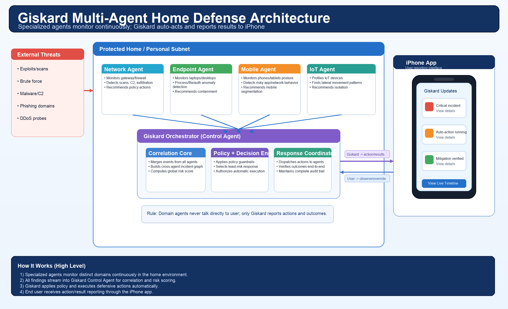
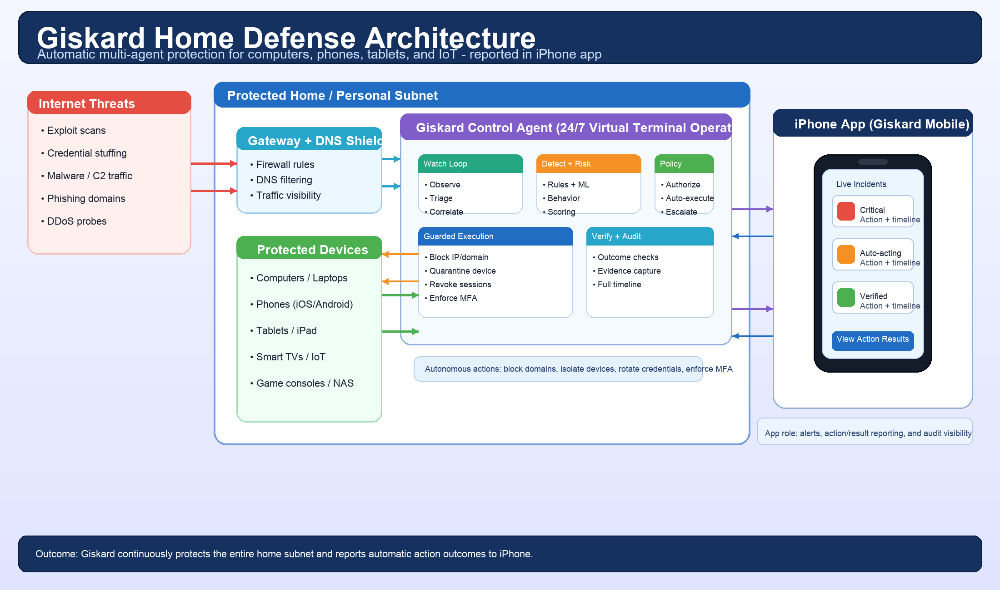
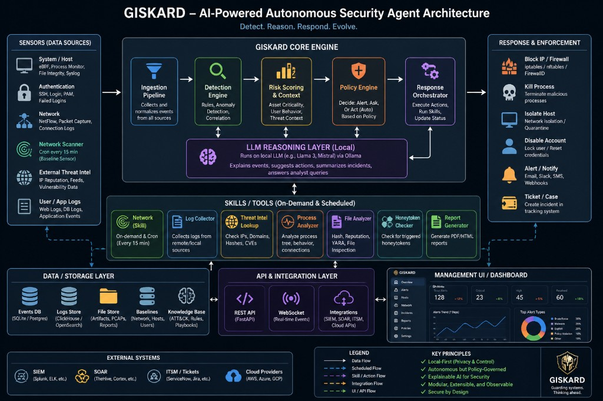
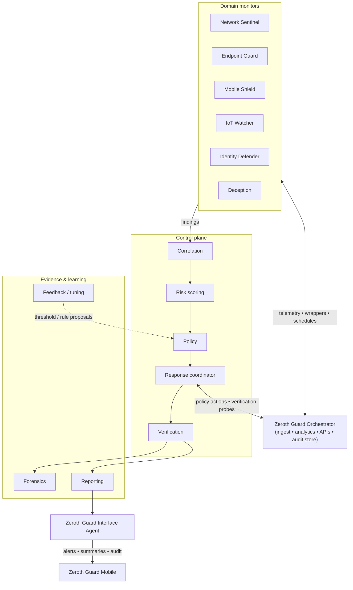

# Zeroth Guard  
## Multi-Agent Autonomous Defense Architecture

---

## Scope and Terminology

- **Zeroth Guard**: the full defense platform.
- **OpenClaw agent swarm**: specialized monitoring and decision agents running in parallel.
- **Network scan agent (network pulse)**: a **swarm skill/tool**—not a parallel control plane. Domain agents invoke it on a schedule or when investigations need fresh topology and inventory; results normalize into events for the orchestrator. Implementation is pinned at `external/network-scan-agent` ([network-scan-agent](https://github.com/ericrkern/network-scan-agent)), with an OpenClaw-facing **executable wrapper** at `tools/network_pulse/` (manifest + `wrapper.py`) suitable for gated `exec` calls.
- **Workspace skills (`skills/`)**: curated **AgentSkills**-style `SKILL.md` bundles that recommend optional [ClawHub](https://clawhub.ai/) capabilities (integrations, automation, IoT context, search, memory patterns). They provide prompts and install pointers only—upstream skill code is installed via `openclaw skills install` after operator review ([OpenClaw skills](https://docs.openclaw.ai/tools/skills)).
- **Repository tools (`tools/`)**: (1) **wrappers** that run deterministic subprocesses (for example Network Pulse); (2) **`tools/openclaw/`** registry YAML listing OpenClaw **built-in and documented extension tools** for allowlisting—those tools ship with the OpenClaw gateway or plugins, not as code in this repo ([Tools and plugins](https://docs.openclaw.ai/tools)).
- **Zeroth Guard Orchestrator**: the only component that correlates all agent findings and communicates with end users.
- **Zeroth Guard Mobile (iPhone app)**: the only end-user interface for action/result reporting and audit views.

The figure **Zeroth Guard AI-Powered Autonomous Security Agent Architecture** (`zeroth-guard-ai-powered-agent-architecture.png`) summarizes the **core processing pipeline** inside the orchestrator: ingestion → detection → risk and context → policy disposition → response orchestration, plus local LLM reasoning, modular skills, storage, APIs, and integrations. It may show a generic operator **web dashboard** for visualization; that surface is **optional** (admin/SOC or internal tooling). **Customer-facing** interaction remains **Zeroth Guard Mobile only**, consistent with the User Interface Plane below.

Related documents:
- `docs/zerothguard.md` (Asimov / Zeroth Law naming background)
- `docs/agents.md`
- `docs/hardware.md`
- `docs/ios-app-spec.md`
- `docs/mvp.md`
- Network Pulse / network scan agent deployment and data paths: `external/network-scan-agent/docs/configuration.md`
- OpenClaw workspace skill recommendations: `skills/README.md` (per-skill `skills/*/SKILL.md`)
- Executable wrappers + OpenClaw tool registry: `tools/README.md`, `tools/openclaw/README.md`, `tools/openclaw/zeroth-guard-openclaw-tools.yaml`
- OpenClaw agent personas + swarm manifest: `agents/README.md`, `agents/SOUL.md`, `agents/AGENTS.md`, `agents/swarm-manifest.yaml`, `agents/roles/`

---

## 1. Overview

**Zeroth Guard** is an autonomous, policy-driven security platform designed to:

- Continuously monitor systems connected to the internet  
- Detect intrusion attempts and anomalous behavior in real time  
- Automatically contain and mitigate threats  
- Preserve forensic evidence  
- Provide actionable reporting and insights  

Zeroth Guard operates as a **multi-agent swarm** with a local orchestrator in the protected subnet, enabling fast local response with shared intelligence across specialized agents.

Zeroth Guard is designed to behave like a **24/7 virtual terminal security operator**: continuously watching live system activity, investigating suspicious patterns as they emerge, and applying defensive changes immediately when policy conditions are met.

By default, defensive actions are **automatic** under policy guardrails and executed by the Zeroth Guard control agent. The iPhone app reports resulting actions and outcomes rather than serving as a manual approval gate for normal operations.

---

## 2. Goals

### Primary Objectives
- Real-time threat detection and response
- Autonomous containment of attacks
- Continuous terminal-style monitoring and intervention
- Subnet-wide protection for home and small-office networks
- Protection for phones and tablets on protected subnets
- Deliver a secure iOS app for mobile visibility, alerts, and guided response
- Full audit trail and forensic readiness
- Identity-aware security enforcement
- Scalable across hosts, containers, and cloud environments

### Design Principles
- **Autonomous First** - Works even when disconnected
- **Local-First (Privacy & Control)** - Sensitive telemetry and reasoning stay on the protected subnet where feasible
- **Policy Driven** - Deterministic guardrails for all actions
- **Least Risk Response** - Escalate only when necessary
- **Explainable Actions** - Every action is auditable; local LLM outputs augment explanation but do not bypass policy
- **Zero Trust Enforcement** - Continuous verification
- **Tamper Resistant** - Protect the agent itself
- **Operator-Grade Vigilance** - Always-on monitoring loop with immediate action
- **Modular, Extensible, Observable** - Skills/tools and integrations attach through guarded interfaces

---

## 3. High-Level Architecture

The system is composed of major domains:

### 3.1 External Threat Surface
- Internet attackers (exploits, brute force, malware, DDoS)
- Insider threats and stolen credentials
- Third-party integrations and cloud services

### 3.2 Protected Subnet Agent Swarm (OpenClaw Runtime)
- Domain monitoring agents (network, endpoint, mobile, IoT, identity, deception)
- **Swarm skills/tools** (for example the **network scan agent** via `tools/network_pulse/`) invoked by agents for scheduled or on-demand discovery, baseline snapshots, and drift signals—outputs feed the orchestrator like any other sensor-derived finding
- **OpenClaw gateway tools** (`exec`, `web_search`, `sessions`/`subagents`, `cron`, filesystem tools, optional browser—see `tools/openclaw/zeroth-guard-openclaw-tools.yaml`) under explicit **allowlists** and **[exec approvals](https://docs.openclaw.ai/tools/exec-approvals)**; dangerous or customer-impersonating tools (`message`, `browser`, `gateway`) default to **operator-only** or **denied** for autonomous defense agents
- **Workspace skills** from `skills/` injected into agent context per OpenClaw precedence rules—optional ClawHub installs for integrations (Composio), automation (n8n), IoT (Home Assistant), grounded search (Exa / SearXNG / Ollama search), tuning memory (self-improving pattern), voice (ElevenLabs), transcription (Whisper), and cautious protocol-analysis guidance
- Local processing (detection + risk + policy proposals)
- Coordinated enforcement through guarded command pipelines
- Evidence and audit event production

### 3.3 Protected Subnet (Home / Small Office LAN)
- Gateway and DNS visibility (router, firewall, resolver logs)
- East-west traffic monitoring for lateral movement
- Device profiling for IoT, endpoints, phones/tablets, and unmanaged hosts
- Segment-aware response across trusted and untrusted zones

### 3.4 Zeroth Guard Orchestrator (Local Control Plane)
- Event ingestion and streaming
- Correlation and analytics
- Global policy engine
- Response orchestration
- Reporting and case management

### 3.5 User Interface Plane (iPhone App Only)
- Incident alerts and summaries
- Approval flow for sensitive actions
- Verification and audit visibility
- No direct end-user communication from domain agents

Optional **operator web dashboards** (for example FastAPI-backed REST plus a React UI) may exist in some deployments for administrators or service operators; they are not a substitute for the iPhone app as the defined **customer** control and audit surface.

### 3.6 Agent swarm topology (OpenClaw)

The **OpenClaw runtime** hosts parallel agent workers mapped to Zeroth Guard roles (`docs/agents.md`, `agents/swarm-manifest.yaml`, `agents/roles/`). Domain monitors emit **findings**; control-plane agents merge, score, authorize, **execute**, and **verify**; evidence agents preserve narratives and tuning signals; only the **Zeroth Guard Interface Agent** shapes user-visible messaging for **Zeroth Guard Mobile**.

**Agent roster (logical IDs)**

| Tier | Agents |
|------|--------|
| Domain monitors | Network Sentinel, Endpoint Guard, Mobile Shield, IoT Watcher, Identity Defender, Deception |
| Control plane | Correlation, Risk scoring, Policy, Response coordinator, Verification |
| Evidence & learning | Forensics, Reporting, Feedback / tuning |
| Customer interface | Zeroth Guard Interface Agent only |

Enforcement runs **only** through **Policy → Response coordinator** after authorization; domain monitors do not bypass that chain. Personality and operating constraints live in `agents/SOUL.md` and `agents/AGENTS.md`.

---

## 4. Component Architecture

### 4.1 Sensor Layer (Host-Based)

Collects telemetry from multiple sources:

| Sensor Type | Description |
|------------|------------|
| Kernel / eBPF | Syscalls, runtime behavior |
| Process & Host Telemetry | Process monitoring, syslog and host audit streams |
| Network Monitoring | Connections, flows, NetFlow, packet capture metadata |
| File Integrity | Sensitive file changes |
| Auth & Identity | SSH/PAM/login trails, failed auth, tokens, privileges |
| Application Logs | Web, database, API, and service events |
| External Threat Intelligence | IP/domain/hash reputation, CVE and vulnerability context |
| Scheduled Network Baseline | Periodic discovery or drift checks against expected topology—typically produced when swarm agents run the **network scan agent** skill (see §4.2 modular skills) |
| Deception | Honeytokens, decoys |

---

### 4.1.1 Subnet Sensor Layer (Gateway + LAN)

Collects home/small-office network telemetry:

| Sensor Type | Description |
|------------|------------|
| Router / Firewall Logs | Inbound blocks, NAT flows, denied connections |
| DNS Monitoring | Domain lookups, sinkhole actions, suspicious destinations |
| DHCP / ARP Visibility | Device inventory, MAC/IP mapping, rogue devices |
| NetFlow / Packet Metadata | East-west and north-south traffic patterns |
| Wi-Fi Access Events | New client joins, auth failures, unusual roaming |
| Mobile Device Signals | OS type, posture state, risky app/network behavior (when available) |

---

### 4.2 Local Processing

#### Event Normalization
- Converts raw logs into structured events
- Adds metadata (host, user, process, context)

#### Detection Engine
- Signature-based rules (Sigma-like)
- Behavioral anomaly detection
- Sequence-based attack detection
- MITRE ATT&CK mapping

#### Terminal Watch Loop
- Maintains a continuous watch cycle over process, network, auth, and file events
- Prioritizes suspicious activity queues by risk and recency
- Correlates short event windows (seconds to minutes) like a live analyst session
- Triggers policy checks continuously, not only on batch intervals

#### Risk Scoring Engine
Evaluates:
- Confidence of detection
- Asset criticality
- Privilege level
- Blast radius
- Correlation with other events

#### Policy Engine
Determines response using **risk-informed disposition** alongside explicit outcomes:

| Disposition | Meaning |
|-------------|---------|
| **Alert** | Notify and record; no automated containment unless paired with risk thresholds |
| **Ask** | Escalate for human or app-mediated confirmation on sensitive paths |
| **Act (Auto)** | Execute policy-authorized enforcement automatically under guardrails |

Typical **risk-to-response** mapping:

| Risk Level | Action |
|----------|--------|
| Low | Log + Alert |
| Medium | Throttle / Step-up Auth |
| High | Block / Kill / Revoke |
| Critical | Isolate / Quarantine |

#### Local LLM reasoning layer (optional)
A **local** large language model runtime (for example via **Ollama** with models such as Llama 3 or Mistral) assists the core engine without replacing deterministic policy:

- Explain correlated events and incident context in natural language
- Propose candidate actions that still must pass policy and simulation gates
- Summarize timelines for operators and mobile clients
- Answer constrained analyst-style queries over stored events and knowledge

The LLM does **not** directly execute enforcement commands; execution remains with the response orchestrator and guarded pipelines.

#### Modular skills and tools
On-demand and scheduled **skills** compose investigations and responses. Swarm agents call these through guarded interfaces (same policy and audit envelope as other agent actions); skills do **not** bypass the orchestrator for customer-facing reporting or autonomous enforcement decisions.

| Skill / Tool | Role |
|--------------|------|
| Network scan agent (network pulse) | **Swarm-invoked** LAN discovery—upstream repo at `external/network-scan-agent`; OpenClaw invokes **`tools/network_pulse/wrapper.py`** (`pulse` / `deep`) under policy; see **capabilities** below |
| Log collector | Pull or receive logs from local and remote sources |
| Threat intel lookup | Resolve IPs, domains, hashes, CVE references |
| Process analyzer | Inspect trees, behavior, and network bindings |
| File analyzer | Hashing, reputation, YARA, structured inspection |
| Honeytoken checker | Detect deception triggers |
| Report generator | Produce PDF/HTML or structured exports for cases |

##### Network scan agent — reference implementation capabilities (`external/network-scan-agent`)

These behaviors describe the **current Network Pulse codebase** so swarm integration can map outputs to normalized events (inventory changes, posture deltas, correlation signals). Scheduling, subnets, and ports are **configurable** in code; values below are the stock reference profile.

**Discovery loop (pulse)**
- **Cadence:** periodic runs via **systemd timer** or **cron** (deployment examples use **15-minute** intervals for pulse; alternate profiles may use hourly schedules).
- **Scope:** multiple **RFC 1918 /24 subnets** in one run (reference list includes several `192.168.x.0/24` ranges—extend or narrow per site).
- **Live host finding:** sweep addresses per subnet (e.g. ping-driven reachability) before finer probes.
- **TCP service discovery:** probe a **common-services port set** (reference includes SSH, HTTP/S, SMB, IPP, alternative HTTP ports, VNC-class and dev ports such as **22, 80, 443, 445, 631, 8080, 5900, 3000, 5000**).
- **Enrichment:** resolve **hostnames** and **MAC addresses** where available; apply **heuristic device typing** (for example printer vs router vs phone-class endpoints).
- **Dedup and drift:** maintain a **seen-device cache** (`.seen_devices.json`) so only genuinely **new** hosts raise prominent alerts; append **scan history** statistics (new vs online vs total known).

**Structured artifacts for downstream agents**
- **`devices.md`:** human-readable rolling inventory, **new-device alert** sections with timestamps, optional consolidated sections (for example **iPhone identity correlation** comparing reference vs routed-subnet candidate IPs using MAC/hostname evidence logged to `.iphone_identity_checks.json`).
- **`.scan_snapshots.json`:** time-series **online-device snapshots** per scan for baseline and drift analysis.
- **`deep_scan_results.json`:** latest **deep inspection** payload consumed by tooling that needs port/service detail.

**Optional deep inspection (`deep_scan.py`)**
- Multi-stage **nmap** workflow per host: host discovery gate; **fast TCP discovery** (e.g. top ports); **full TCP** on responsive hosts; **UDP** probes against a **common UDP service list**; **service/version and safe script** fingerprinting (e.g. banners, HTTP title, TLS cert, SSH algorithms, SMB OS hints); **optional OS detection** when executed with sufficient privileges.
- Intended for **on-demand or scheduled depth**, not every pulse tick—agents should invoke under policy to manage runtime and network noise.

**Network Pulse dashboard (operator tooling, optional)**
- **Flask** web UI (typical **port 5000**) over the same inventory files: live **online/offline/unknown** status, search/filter, **manual scan trigger**, auto-refresh.
- Companion **HTTP APIs** (for example device summaries plus optional **audit**, **Wi‑Fi SSID visibility**, and **packet/trace summaries**) backed by **sudo-scoped helper scripts** where deployments enable `auditd`, wireless scans, or controlled captures—see `external/network-scan-agent/docs/configuration.md`.
- This dashboard is **internal/operator** convenience; it does **not** replace **Zeroth Guard Mobile** as the customer-facing plane.

**Runtime dependencies (reference)**
- **Python 3**, **`nmap`** for discovery and deep scans; deployment docs also reference helpers such as **tcpdump** / **tshark**, **netcat**, and **auditd** when dashboard audit/trace features are enabled.

##### OpenClaw workspace skills (`skills/`)

Agent-facing guidance lives in **`skills/*/SKILL.md`** ([AgentSkills](https://agentskills.io/)-compatible). Each entry documents **when** the capability helps Zeroth Guard and **how** to install from [ClawHub](https://clawhub.ai/)—not vendored code. Recommended bundles in this repository:

| Skill folder | Intended use |
|--------------|----------------|
| `skills/composio/` | Broad SaaS/API integrations (ticketing, GitHub, Slack-style glue) behind least-privilege credentials |
| `skills/n8n-workflow-automation/` | Local playbook and enrichment automation |
| `skills/home-assistant/` | IoT state context for **IoT Watcher** correlations |
| `skills/exa-search/` | Technical / doc-grounded search (requires API key when enabled) |
| `skills/self-improving-agent/` | Structured operational memory and tuning notes—never auto-promoted to policy |
| `skills/elevenlabs-agents/` | Optional voice escalation—policy-gated, not a customer channel |
| `skills/openai-whisper/` | Transcription for analyst notes—confirm local vs API behavior before enablement |
| `skills/protocol-reverse-engineering/` | Traffic/protocol investigation posture—high misuse risk; human-directed |

Third-party skills are **untrusted until reviewed** ([OpenClaw skills security](https://docs.openclaw.ai/tools/skills)).

##### Repository tools (`tools/`) and OpenClaw runtime registry

**Executable wrappers** live under `tools/<name>/` with a README and, where applicable, an OpenClaw-oriented manifest (for example `tools/network_pulse/openclaw_tool.yaml`). Agents typically invoke wrappers through **`exec`** with command allowlists and timeouts.

**OpenClaw built-in and documented extension tools** are enumerated in **`tools/openclaw/zeroth-guard-openclaw-tools.yaml`** for architecture and onboarding alignment. That file groups:

- **Built-ins** — for example `exec` / `process`, `code_execution`, `browser`, `web_search`, `x_search`, `web_fetch`, `read` / `write` / `edit`, `apply_patch`, `message`, `canvas`, `nodes`, `cron`, `gateway`, media tools (`image`, `image_generate`, `tts`, …), session orchestration (`sessions_*`, `subagents`, `session_status`, `agents_list`), `memory_search` / `memory_get` when memory is enabled ([tools index](https://docs.openclaw.ai/tools)).
- **Extensions** — documented search and workflow helpers (Exa, SearXNG, Ollama search, Tavily, Perplexity, …), `llm-task`, `lobster`, `pdf`, sandbox / elevated-mode docs, etc., as linked in the registry.

**Configuration practice:** use OpenClaw **`tools.allow` / `tools.deny`** and **`tools.profile`** so autonomous defense agents retain **`group:fs`**, **`group:web`** (sanitized), **`cron`**, **`subagents`**, tight **`exec`**, and **deny by default** `browser`, `gateway`, and **`message`** unless an operator agent explicitly needs them. Customer-visible alerting remains **Zeroth Guard Mobile**, not chat channels.

---

### 4.3 Local Enforcement

Executes immediate defensive actions:

- Block IP / traffic (iptables / nftables / firewalld or equivalent host firewall APIs)
- Kill malicious processes
- Revoke sessions / tokens
- Isolate container or host
- Disable accounts
- Rotate secrets / credentials
- Enforce MFA / step-up authentication
- Apply host hardening updates (firewall rules, service restrictions, access controls)
- Apply subnet controls (block domain, isolate VLAN/SSID, quarantine device)
- Trigger mobile-focused controls (isolate phone/tablet network segment, restrict risky destinations, force re-auth via IdP)

Enforcement is implemented as a guarded command pipeline that mirrors terminal operations:
- **Observe** -> **Evaluate** -> **Simulate** -> **Execute** -> **Verify** -> **Record**

---

### 4.4 Evidence & Data Store

Tiered storage aligns high-volume telemetry with structured incident state:

| Tier | Typical technology | Contents |
|------|-------------------|----------|
| Events / incident metadata | SQLite or Postgres | Sessions, incidents, entities, workflow state |
| Logs / search analytics | ClickHouse or OpenSearch | High-volume normalized logs and hunt queries |
| File / artifact store | Object or filesystem vault | PCAP excerpts, disk artifacts, generated reports |
| Baselines | Configurable store | Expected network topology, host posture, user behavior baselines |
| Knowledge base | Versioned artifacts | MITRE ATT&CK mappings, detection rules, response playbooks |

Stores forensic artifacts:

- Raw event logs
- Packet snippets
- Process metadata
- System snapshots
- Timeline reconstruction

Features:
- Tamper-resistant storage
- Secure buffering
- Audit-ready logs

---

### 4.5 Central Platform (Control Plane)

#### Ingest & Message Bus
- Kafka / NATS streaming pipeline
- Secure ingestion (mTLS)

#### API & realtime gateway
- REST API (for example **FastAPI**) for configuration, queries, and mobile backends
- WebSocket or SSE for live incidents and orchestration status

#### Analytics & Correlation
- Multi-host correlation
- Threat intelligence enrichment
- ATT&CK mapping

#### Global Policy Engine
- Organization-wide policies
- Context-aware decisioning
- Risk-based enforcement

#### Response Orchestrator
- Executes coordinated actions
- Cross-system remediation
- Playbooks and automation

#### Data & Reporting
- Case management
- Dashboards
- Incident timelines
- Compliance reporting

---

### 4.6 Integrations

- SIEM / XDR platforms
- SOAR tools
- Identity providers (IAM / IdP)
- Ticketing systems
- Email / Slack / SMS alerts and outbound webhooks
- Threat intelligence feeds
- Secrets managers
- Home/SOHO routers and firewalls (API/SSH)
- DNS filtering resolvers and network controllers
- Mobile device management / endpoint posture platforms (MDM/UEM)
- Apple Push Notification service (APNs) for real-time incident alerts

---

### 4.7 Autonomous Terminal Operator Mode

Zeroth Guard's orchestrator runtime models an experienced SOC engineer at a shell:

- Continuously tails and inspects critical telemetry streams
- Opens short-lived investigations for suspicious chains of events
- Executes policy-authorized defensive commands through guardrails
- Verifies command outcomes and rolls forward to stronger controls if needed
- Produces an auditable command/action timeline for every mitigation step

---

### 4.8 iOS App Architecture (Zeroth Guard Mobile)

The iOS app extends Zeroth Guard into a secure mobile control and response surface.

#### App Modules
- **Auth & Session Module**: Sign in with OIDC/IdP, MFA, token refresh, device binding
- **Incident Feed Module**: Real-time alerts, risk levels, ATT&CK context, host/subnet impact
- **Response Actions Module**: Policy-authorized automatic actions (isolate device, block domain, revoke session)
- **Device Posture Module**: App integrity, jailbreak detection signals, local security checks
- **Evidence Viewer Module**: Incident timeline, command history, verification outcomes
- **Settings & Policy View Module**: Notification preferences, subnet memberships, trust status

#### iOS Security Controls
- Store credentials in iOS Keychain (Secure Enclave-backed when available)
- Enforce certificate pinning and mTLS for API calls
- Require biometric/PIN gate for sensitive response actions
- Sign and verify action requests with short-lived tokens and nonce protection
- Use least-privilege permissions and minimize local data retention

#### Mobile Backend/API Requirements
- `POST /mobile/auth/exchange` for secure session bootstrap
- `GET /mobile/incidents` and `GET /mobile/incidents/{id}` for feed and detail
- `POST /mobile/actions` for policy-validated response actions
- `GET /mobile/devices` for subnet/mobile inventory and trust posture
- WebSocket or SSE channel for live updates and response confirmations

#### Notification and Action Flow
1. A domain agent detects threat activity and publishes findings
2. Zeroth Guard correlates, scores risk, and creates an incident
3. Control plane sends APNs push with minimal metadata
4. Backend validates policy and executes automatic response actions
5. User opens app and fetches signed incident details
6. App receives executed-action results and audit trail updates

---

## 5. Data Flow

1. Domain agents collect events across host, network, mobile, and IoT surfaces (including **network pulse** runs via `tools/network_pulse/` or equivalent scheduler)  
2. Domain agents normalize findings and submit them to Zeroth Guard Orchestrator  
3. Correlation and risk scoring produce a unified incident view  
4. Policy engine determines allowed action paths  
5. Response coordinator dispatches policy-authorized enforcement actions  
6. Enforcement results are verified against expected outcomes  
7. Evidence and audit timelines are captured and stored  
8. Gateway/DNS/subnet controls are updated as needed  
9. Mobile clients receive incident updates and verified response outcomes  
10. Feedback loop improves rules, models, and policy playbooks  

---

## 6. Example Attack Flows

### 6.1 Web Exploit -> Shell Execution

1. Attacker sends exploit request  
2. Web server spawns unexpected shell  
3. Detection engine flags anomaly  
4. Risk score = high  
5. Policy triggers:
   - Kill process  
   - Block IP  
   - Capture evidence  
6. Incident logged and reported  

---

### 6.2 Credential Stuffing

1. Multiple failed logins detected  
2. Successful login follows  
3. Correlation identifies attack pattern  
4. Policy triggers:
   - Revoke session  
   - Force MFA  
   - Rate limit attacker  

---

### 6.3 Data Exfiltration Attempt

1. Sensitive files accessed  
2. Large archive created  
3. Outbound connection detected  
4. Policy triggers:
   - Block network traffic  
   - Suspend process  
   - Quarantine host  

---

### 6.4 Home Subnet Lateral Movement Attempt

1. Unknown IoT device begins scanning multiple LAN hosts  
2. DNS lookups resolve to known malicious C2 domains  
3. Correlation engine detects east-west propagation pattern  
4. Policy triggers:
   - Block destination domains at local resolver  
   - Isolate device to quarantine VLAN/SSID  
   - Push deny rules to home gateway firewall  
5. Incident and device timeline are captured for review  

---

### 6.5 Mobile Device Compromise on Home Wi-Fi

1. Tablet connects to home Wi-Fi and starts unusual outbound traffic spikes  
2. DNS requests match high-risk phishing/C2 domains  
3. Correlation engine links behavior to known mobile malware patterns  
4. Policy triggers:
   - Block malicious domains at resolver  
   - Move device to restricted/quarantine network segment  
   - Require account re-authentication and step-up verification  
5. Incident timeline is recorded with mobile device context  

---

## 7. Automated Response Capabilities

- Block attacker IPs/domains  
- Kill malicious processes  
- Revoke tokens and sessions  
- Isolate hosts and containers  
- Isolate compromised devices on a home subnet
- Enforce subnet segmentation policies (trusted vs untrusted VLANs)
- Apply policy controls for phones/tablets on guest or quarantine segments
- Rotate credentials and secrets  
- Enforce step-up authentication  
- Capture forensic evidence  

---

## 8. Feedback Loop

Continuous improvement cycle:

1. Analyst reviews incident  
2. Rules are tuned  
3. Models retrained  
4. Policies updated  

---

## 9. Deployment Model

Supported environments:

- Physical servers  
- Virtual machines  
- Containers (Kubernetes)  
- Cloud instances  
- Home and small-office subnets (single gateway to segmented LANs)
- Mobile endpoints (phones and tablets) connected to protected subnets

Deployment pattern:
- Lightweight agent per host  
- Centralized control plane (cloud or on-prem)
- Optional hardened command runner for privileged response actions
- Optional gateway connector for router/firewall and DNS enforcement
- iOS companion app distributed via App Store or enterprise MDM
- Mobile API gateway for app traffic, auth, and push event fanout

---

## 10. Security Considerations

- Encrypted communication (mTLS)
- Least privilege access
- Signed updates
- Tamper-resistant logs
- Secure bootstrapping
- Isolation of agent components
- **OpenClaw tools and ClawHub skills:** review every workspace skill and registry-listed tool before enablement; prefer sandboxed or approval-gated **`exec`**, never expose **`gateway`** or **`browser`** to untrusted prompts, and treat **`message`** channels as operator-only ([sandboxing](https://docs.openclaw.ai/gateway/sandboxing), [exec approvals](https://docs.openclaw.ai/tools/exec-approvals))

---

## 11. Technology Stack (Recommended)

### Agent
- Language: Rust or Go  
- Telemetry: eBPF / ETW  
- Enforcement: iptables / system APIs  
- Runtime: supervised daemon with resilient watch loop scheduler
- Subnet adapters: router APIs, DNS filtering APIs, DHCP/ARP collectors
- Mobile adapters: MDM/UEM connectors and mobile posture signals (where permitted)

### OpenClaw runtime (swarm host)

- **Gateway** hosts built-in tools and optional plugins per [Tools and plugins](https://docs.openclaw.ai/tools); allowlists in `openclaw.json` align with `tools/openclaw/zeroth-guard-openclaw-tools.yaml`
- **Workspace skills** loaded from `skills/` (and managed installs under `~/.openclaw/skills` when used)—see [Skills](https://docs.openclaw.ai/tools/skills)
- **Wrapped subprocesses:** `tools/network_pulse/wrapper.py` for Network Pulse; extend `tools/` for additional guarded CLI adapters

### Backend
- Event Bus: Kafka / NATS  
- Storage: SQLite or Postgres for transactional incident state; OpenSearch / ClickHouse for log analytics  
- Policy Engine: OPA  
- API: FastAPI / Go  
- Mobile Push: APNs provider service
- Realtime: WebSocket/SSE gateway for incident streaming

### iOS App
- Language/UI: Swift + SwiftUI
- Networking: URLSession + async/await
- Local Security: Keychain, Secure Enclave, LocalAuthentication
- App Architecture: MVVM with modular feature boundaries
- Telemetry: Privacy-preserving mobile diagnostics and crash reporting

### UI
- React (or similar) **operator dashboard** where deployments include a web console—optional and distinct from **Zeroth Guard Mobile** as the customer-facing interface  
- Real-time alerts  
- Incident visualization  

---

## 12. Future Enhancements

- Advanced ML-based anomaly detection  
- Autonomous deception environments  
- Identity graph modeling  
- Cross-cloud attack correlation  
- AI-driven incident summarization  
- Predictive threat modeling  
- iOS delegated responder workflows for observing automatic actions
- On-device risk briefing generation for incident context

---

## 13. Summary

Zeroth Guard is a **modern multi-agent autonomous security system** that combines:

- specialized domain agents operating in parallel, including **swarm skills** such as the network scan agent (`external/network-scan-agent` + `tools/network_pulse/`) and optional **workspace skills** under `skills/` (ClawHub-backed integrations and automation)
- an explicit **OpenClaw tool surface** catalogued in `tools/openclaw/zeroth-guard-openclaw-tools.yaml`, constrained by allowlists and approvals alongside core filesystem and session tools  
- local orchestration with policy-bounded decisioning  
- automatic response execution directed by the Zeroth Guard control agent  
- subnet-level visibility and control for home environments  
- secure iPhone-based reporting through one trusted interface  

It delivers **fast containment, reduced dwell time, and complete visibility**, enabling organizations to move from reactive security to **proactive, autonomous defense** with the consistency of an always-on defensive terminal operator.

---
