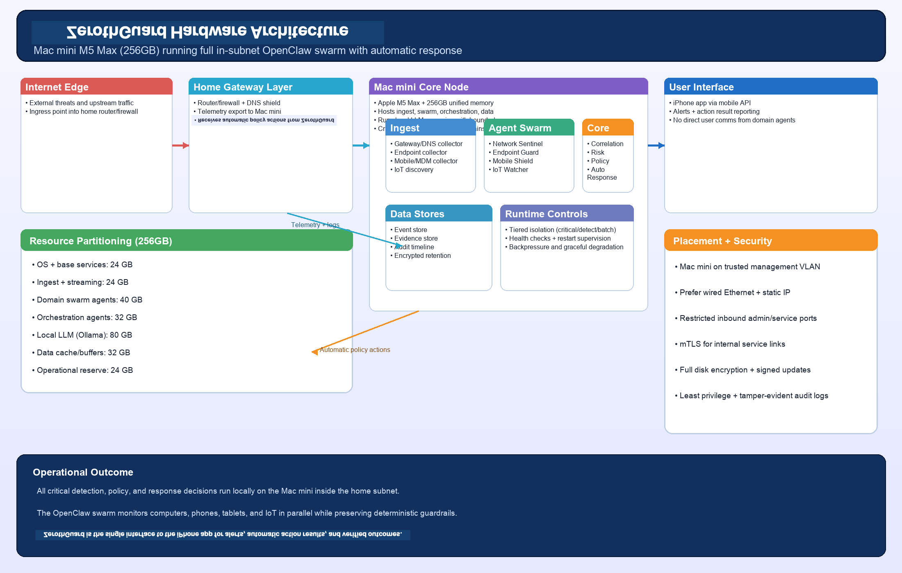
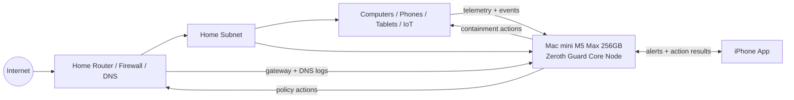
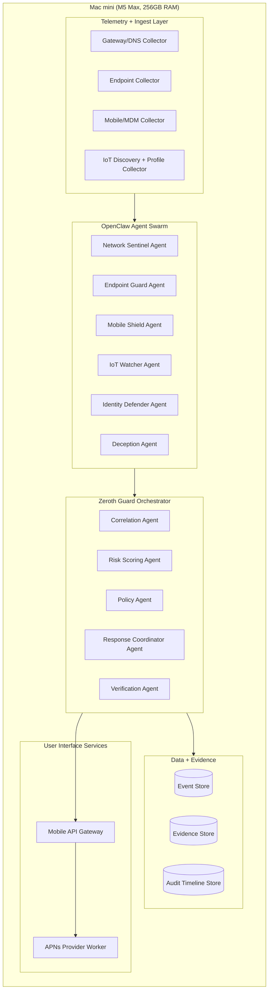

# Zeroth Guard Hardware Architecture

## 1. Deployment Context

This document describes the hardware architecture for running the Zeroth Guard multi-agent swarm on:

- **Host:** Mac mini
- **Processor:** Apple Silicon **M5 Max**
- **Memory:** **256 GB unified memory**
- **Placement:** inside the protected home/personal subnet

Goal: run all core agents locally in a high-trust edge node while keeping latency low and avoiding dependence on external compute for critical defense decisions.

### 1.1 Initial prototype platform (development laptop)

The **first integration prototype** is expected to run on a portable workstation-class laptop with approximately this configuration:

| Component | Specification |
|-----------|----------------|
| OS | **Ubuntu 26.04** |
| CPU | Intel Core **i9-14900HX** |
| GPU | NVIDIA GeForce **RTX 4070 Laptop** (**8 GB** VRAM) |
| System RAM | **32 GB** |
| Storage | **1 TB** |

Treat this as a **development and bring-up target**, not the long-term home-appliance node. Compared with the Mac mini reference profile below, plan for **lower concurrency**, **smaller or more aggressively quantized local LLMs**, and **strict RAM discipline**. Use the **CUDA-capable GPU** for bounded local inference (for example Ollama or llama.cpp with GPU offload) while keeping ingest, policy, and verification paths predictable on CPU unless profiling shows safe headroom. Standardize on **vendor NVIDIA drivers + CUDA user-space** compatible with this Ubuntu release for reproducible GPU offload.

---

## 2. High-Level Hardware Topology

---

## 3. Mac mini Node Architecture

The Mac mini hosts all primary control-plane and agent workloads locally.

---

## 4. Resource Partitioning (Recommended)

Use explicit resource pools so AI workloads cannot starve real-time defense loops. Budgets differ sharply between the **32 GB laptop prototype** and the **256 GB Mac mini** reference deployment.

### 4.0 Memory budget (32 GB development laptop)

Approximate pools for early integration (tune with measurements):

| Pool | Prototype budget |
|------|------------------|
| OS + interactive desktop | 4–8 GB |
| Ingest, collectors, agent swarm, orchestrator | 8–12 GB |
| Databases, indexes, buffers | 4–6 GB |
| Local LLM host RAM (spillover, KV cache, tokenizer) | 4–8 GB |
| Spike headroom | 2–4 GB |

**GPU (8 GB VRAM):** size models and batch concurrency so weights + runtime fit VRAM; fall back to CPU layers or smaller context if inference competes with display or thermal limits. Prefer **quantized** checkpoints suited to consumer laptop GPUs.

### 4.1 Memory Budget (Mac mini reference — 256 GB)
- **OS + base services:** 24 GB
- **Ingest/collectors + stream processing:** 24 GB
- **OpenClaw domain agents:** 40 GB
- **Zeroth Guard orchestration agents:** 32 GB
- **Local LLM runtime (Ollama):** 80 GB
- **Event/evidence data services cache/buffers:** 32 GB
- **Operational headroom/spike reserve:** 24 GB

Total: **256 GB**

### 4.2 CPU/GPU strategy

**Mac mini (Apple Silicon):**
- Pin ingestion, policy, and verification workers to high-priority CPU scheduling classes.
- Run LLM inference with bounded concurrency to protect deterministic control paths.
- Use separate worker pools:
  - **Realtime pool** (detect, policy, execution, verification)
  - **Reasoning pool** (LLM-assisted analysis/summarization)
  - **Batch pool** (reporting, model tuning, archival tasks)

**Development laptop (Intel + NVIDIA RTX 4070 Laptop, 8 GB VRAM):**
- Assume **mobile thermal limits** under sustained load; cap LLM concurrent requests and agent fan-out during demos.
- Prefer **NVIDIA CUDA** for LLM offload where supported; keep **Tier 1** policy/response paths on CPU with predictable scheduling (same isolation intent as §6).
- If VRAM is exhausted, reduce GPU layers, context length, or model size—never bypass policy gates to “speed up” reasoning.

### 4.3 Storage Layout (Suggested)
- Internal NVMe:
  - system + binaries
  - hot event index
  - short-horizon evidence cache
- External encrypted SSD/NAS (optional):
  - long-term evidence archives
  - snapshots/backups
  - incident export bundles

---

## 5. Network Placement and Interfaces

### 5.1 Position in Subnet
- Mac mini resides on trusted management segment/VLAN.
- It ingests telemetry from:
  - router/firewall
  - DNS resolver
  - endpoint/mobile/IoT connectors
- It issues controls to:
  - gateway ACL/firewall APIs
  - DNS blocklist/sinkhole controls
  - segmentation/quarantine controls

### 5.2 Connectivity Recommendations
- Prefer wired Ethernet for the Mac mini.
- Use static DHCP reservation or static IP.
- Restrict inbound access to admin and service ports only.
- Use mTLS for internal service-to-service traffic where feasible.

---

## 6. Execution Isolation Model

Run components in isolated units (containers/process supervisors) with least privilege:

- **Tier 1 (Critical Path):**
  - policy engine
  - response coordinator
  - verification
- **Tier 2 (Detection):**
  - domain monitoring agents
  - correlation/risk workers
- **Tier 3 (Auxiliary):**
  - reporting
  - model tuning
  - summarization

Rules:
- Tier 3 can never block Tier 1.
- LLM services cannot directly execute system/network actions.
- Only policy-authorized command runners perform enforcement.

---

## 7. Reliability and Resilience

### 7.1 Runtime Resilience
- Supervisor restarts failed agent workers.
- Health checks for every agent and connector.
- Backpressure queues for burst events.
- Graceful degradation:
  - if LLM unavailable -> rule/policy-only mode
  - if external services unavailable -> local autonomous mode

### 7.2 Backup and Recovery
- Scheduled config and policy backups.
- Evidence/audit snapshots with integrity checks.
- Recovery runbook for node replacement and state restore.

---

## 8. Security Hardening for the Mac mini Node

- Full-disk encryption enabled.
- Signed/verified updates only.
- Minimal exposed services.
- Strict local firewall policy.
- Secrets in secure vault/Keychain-backed storage.
- Tamper-evident logs and immutable audit copies.
- Admin access restricted by role + MFA.

---

## 9. Operational Sizing Guidance

This hardware profile is sufficient for:
- full home subnet monitoring (computers, phones, tablets, IoT)
- parallel agent swarm execution
- local LLM-assisted incident reasoning
- near-real-time policy enforcement and verification

If sustained event rates increase significantly, scale by:
- adding a second in-subnet node for ingest/analytics split
- moving long-horizon storage/analytics to a secondary system
- keeping policy + response coordinator local on the primary node

---

## 10. Summary

**Near-term:** the **Ubuntu 26.04** laptop (**i9-14900HX / RTX 4070 Laptop / 32 GB RAM / 1 TB**) supports **prototype integration** with constrained parallelism and GPU-sized local models.

**Target:** the Mac mini (M5 Max, 256 GB RAM) acts as a powerful **local defense appliance** for Zeroth Guard:

- runs the full OpenClaw multi-agent swarm
- keeps critical decisions inside the home subnet
- provides resilient, low-latency protection for all device classes
- maintains secure iPhone-based user visibility and control through Zeroth Guard
