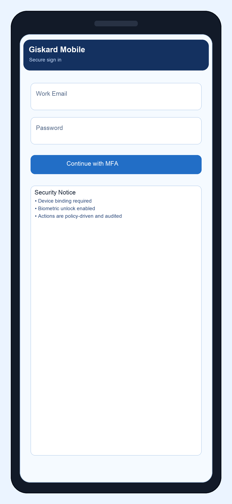
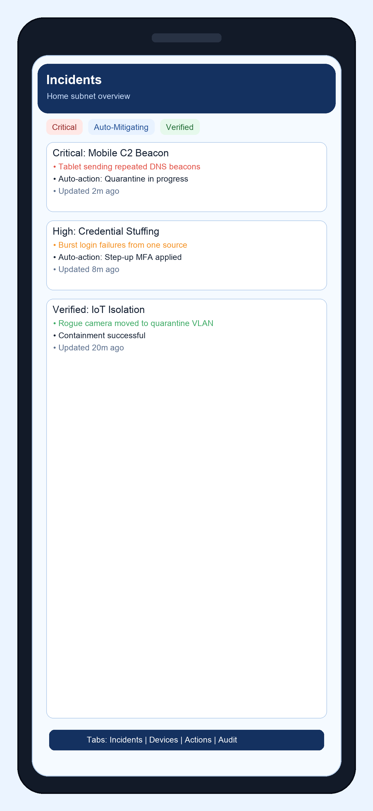
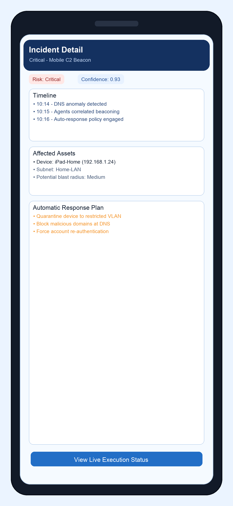
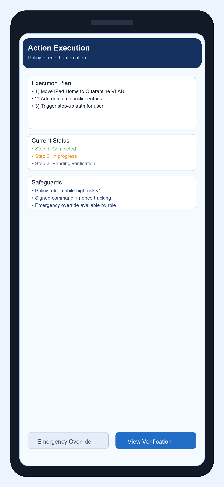
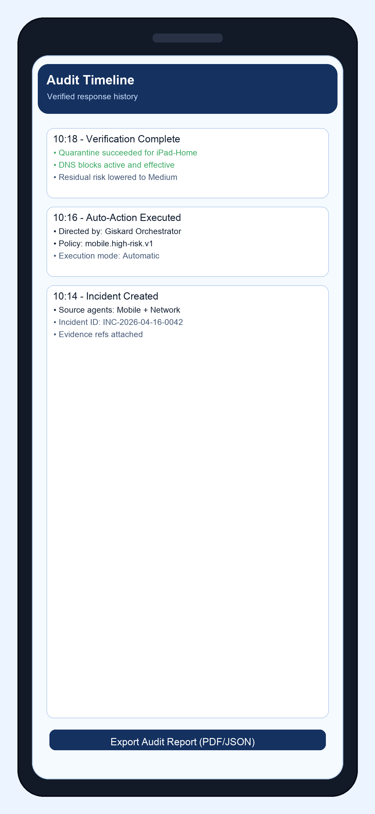

# Giskard Mobile iPhone GUI

## 1. Purpose

This document defines the iPhone user interface for `Giskard Mobile`, the only user-facing surface for the Giskard multi-agent defense platform.

The app is designed to:
- deliver high-signal incident alerts
- present clear automatic action and outcome reporting
- provide complete audit and verification visibility

---

## 2. UX Principles

- **Single trusted interface:** only Giskard communicates to the end user.
- **Fast comprehension:** critical incident details in under 10 seconds.
- **Safe actioning:** no one-tap destructive actions; always confirm.
- **Audit-first:** every user action and autonomous action is visible.
- **Risk-aligned color model:** critical/red, high/orange, verified/green.

---

## 3. Navigation Model

Primary tabs:
- `Incidents`
- `Devices`
- `Actions`
- `Audit`
- `Settings`

Core flow:
1. APNs alert arrives
2. User opens incident detail
3. User reviews policy-directed action and impact
4. Giskard executes defensive actions automatically
5. User observes verification status in audit timeline

---

## 4. Screen Designs

### 4.1 Login and Secure Enrollment

**What this screen does**
- Authenticates with OIDC + MFA
- Enforces secure session setup and device trust registration
- Sets expectation that all actions are audited

**Key UI elements**
- Email and password entry
- `Continue with MFA` action
- Security notice card (device binding, biometric unlock, audit logging)

---

### 4.2 Incident Feed

**What this screen does**
- Presents prioritized incidents by severity and status
- Gives immediate operational context across home subnet assets
- Helps users quickly choose what needs attention now

**Key UI elements**
- Severity chips (`Critical`, `High`, `Verified`)
- Incident cards with short summaries and recency
- Bottom tab context for rapid navigation

---

### 4.3 Incident Detail

**What this screen does**
- Explains what happened, why it matters, and what to do next
- Combines timeline, affected assets, and recommended actions
- Shows what Giskard is doing automatically and why

**Key UI elements**
- Risk and confidence chips
- Timeline card
- Affected assets card
- Recommended action card
- `Review and Approve Action` CTA

---

### 4.4 Action Execution Status

**What this screen does**
- Presents policy-validated actions selected by Giskard
- Shows execution progress and expected impact
- Exposes optional emergency override controls only when policy allows

**Key UI elements**
- Stepwise action plan
- Impact preview (including collateral expectations)
- Security controls panel (override protections, signed nonce request)
- Execution state controls (`In Progress` / `View Verification`)

---

### 4.5 Audit Timeline and Verification

**What this screen does**
- Confirms execution and verification outcomes
- Shows which policy authorized actions and who observed/responded
- Supports incident review and compliance export

**Key UI elements**
- Chronological cards: incident created -> action executed -> verification complete
- Policy and actor traceability
- `Export Audit Report` action

---

## 5. End-to-End Interaction Model

1. Domain agents detect suspicious behavior in the home subnet.
2. Giskard Orchestrator correlates evidence, scores risk, and creates incident.
3. iPhone app receives APNs notification with minimal metadata.
4. User opens incident detail and reviews policy-recommended response.
5. Giskard executes guarded command pipeline and verifies outcome.
6. App updates incident state and writes full audit timeline view.

---

## 6. Security and Trust Controls in UI

- Biometric gate for emergency manual override actions
- Signed request with nonce and short TTL
- Role-aware action visibility (Owner/Responder/Viewer)
- Explicit blast-radius/impact preview before and during automatic execution
- Verification state always shown after execution

---

## 7. Implementation Notes

- Align this GUI with `docs/ios-app-spec.md` for API contracts and data models.
- Use consistent naming from `docs/architecture.md` and `docs/agents.md`.
- Keep user-facing language action-oriented and non-ambiguous during incidents.

---

## 8. Future UI Enhancements

- Device topology mini-map for subnet zones
- Multi-user observer roles for shared households
- Rich ATT&CK mapping view in incident detail
- Guided rollback wizard for failed verification states
